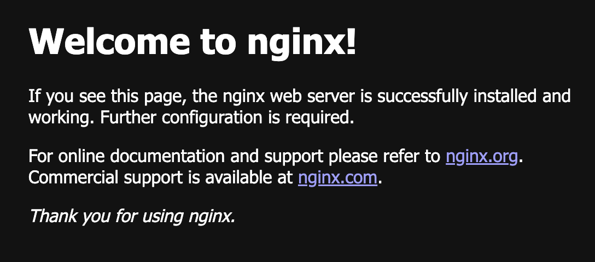
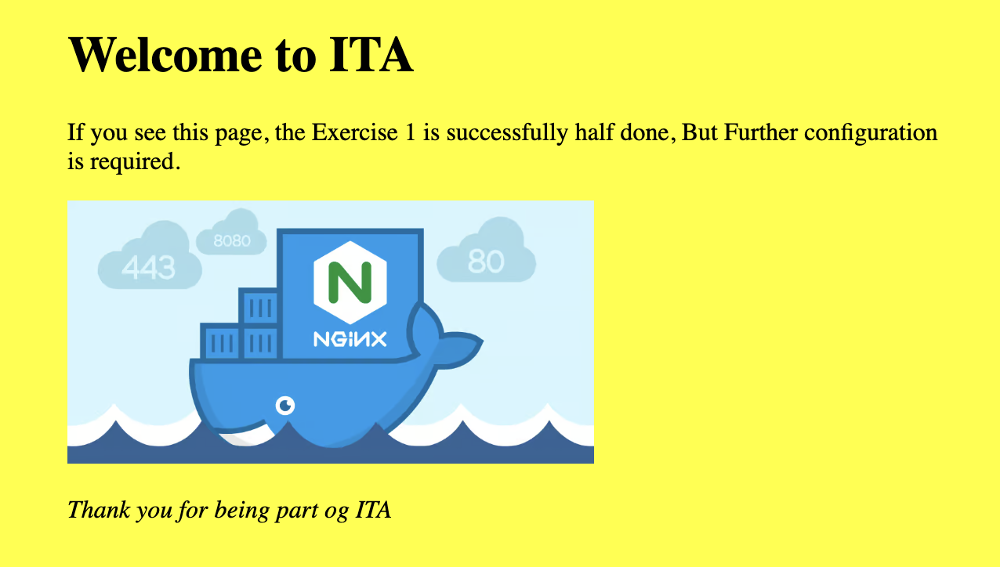

# Docker
## Øvelser

### Øv 1: Lav en ny startside til din nginx server

Kør kommandoen: `docker run -it --rm -p 8080:80 nginx` for at starte din nginx webserver.    
Hvis du går til `http://localhost:8080` kan du se denne side:    

    

**Du skal ændre den så den viser din egen html startside. Feks sådan en:**    
     
    

I vil kunne se hvor html filen er placeret i filsystemet her : https://hub.docker.com/_/nginx   

HINT: I kender til Linux OS, og i har før redigeret i tekstfiler gennem terminalen. 

---

### Øv 2: Ændre portnummer på din nginx server

Stop din nginx server container og start den igen men nu så du kan se den via denne url:

`http://localhost:9000`    

Stop din nginx server container og start den igen men nu så du kan se den via denne url:

`http://localhost`

### Øv 3: Pull og kør en rigtig app :)

Åben din gitbash, eller terminal. Kør kommandoen:    

`docker run -it --rm -p 5000:5000 clbo/flask_crud_demo:0.1.0`    

Hvis det virker kan du i din browser se dene applikation.

`http://localhost:5000`     

Hvis i går ind i containeren gennem terminalen i Docker Desktop, kan i desuden se alle de filer der er i imaged.     

* [Koden på Github kan i også finde her](https://github.com/ITAKEA/flask_crud_demo/tree/master)
* [Image på dockerhub kan i finde her](https://hub.docker.com/r/clbo/flask_crud_demo)

#### Øv 3a: Clone fra github og build et image

Clon dette repsotiroy: [Koden på Github kan i også finde her](https://github.com/ITAKEA/flask_crud_demo/tree/master)

* Build et image udfra dets Dockerfil.    
* Kør en container 
* Se det i browseren
 
<!--    
#### Øv 4: Lav en Dockerfil og et Image
I skal nu lave et docker image som indeholder det flask api projekt som i afleverede i onsdags.    

* Det betyder at I i jeres projekt skal tilføje en Dockerfil.        
* Når i har gjort det skal i lave et image udfra den Dockerfil.     
* Og så skal i køre jeres applikation ved at skrive `docker run .............`    
-->

